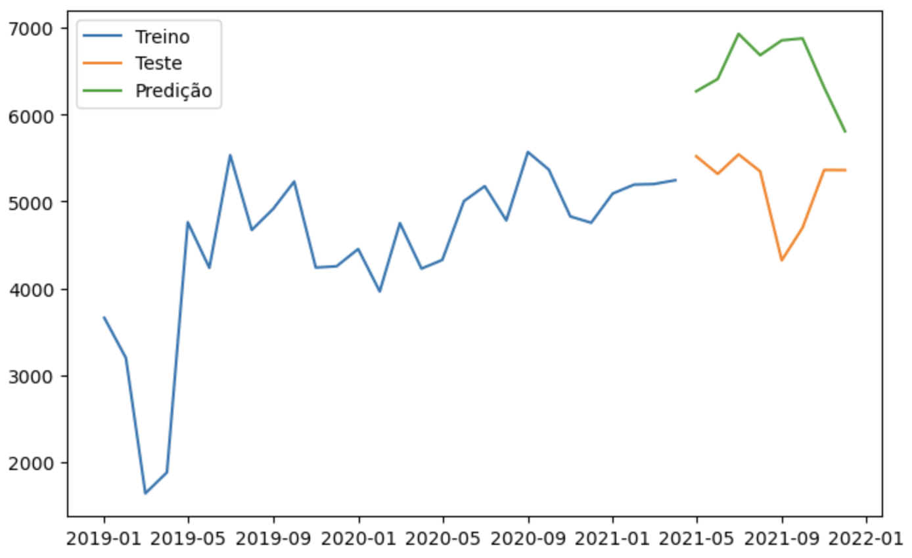
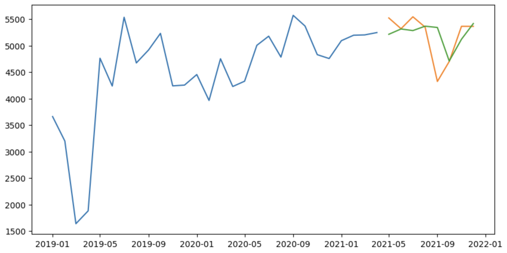
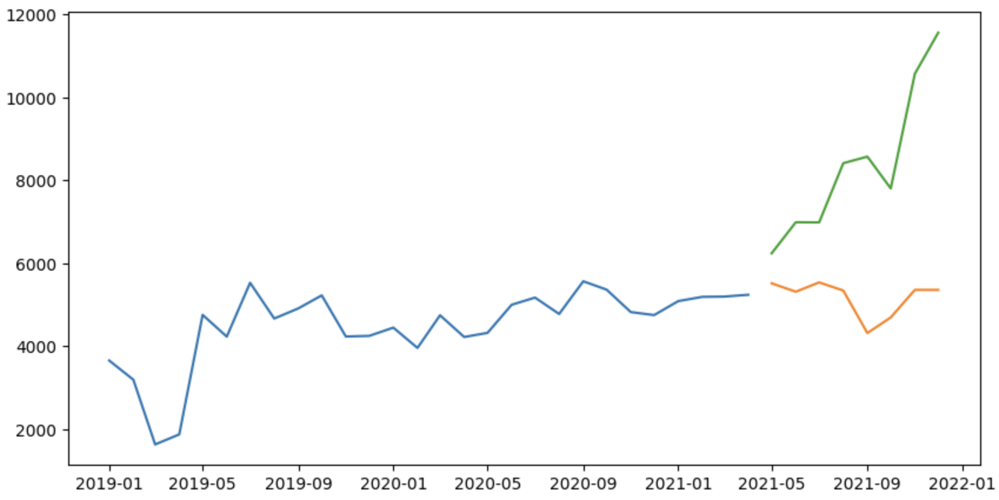
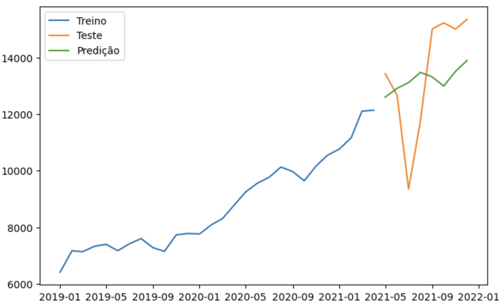
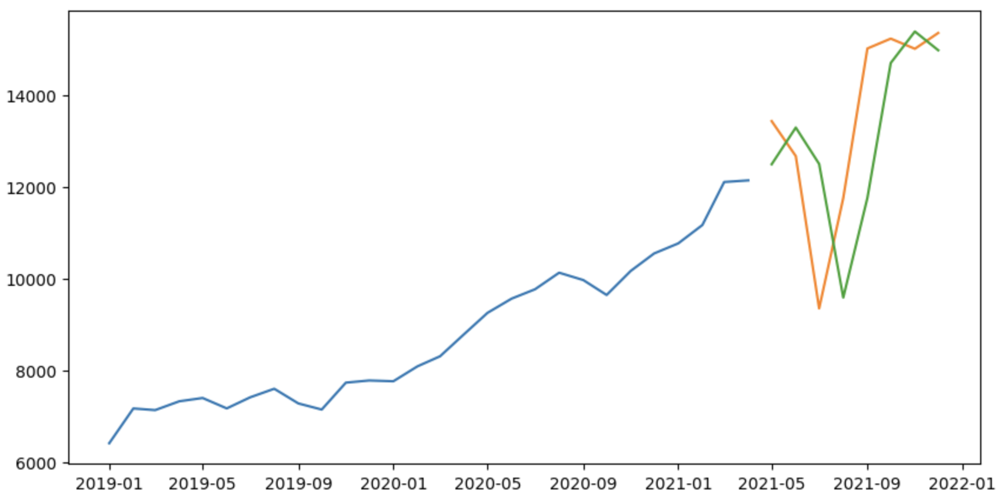
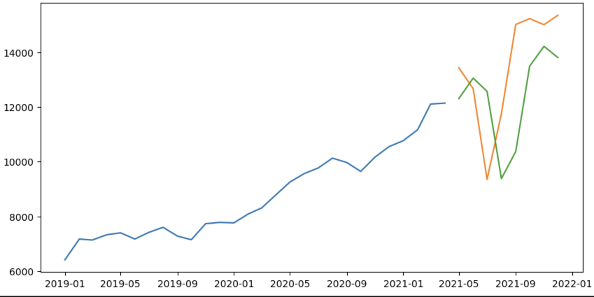
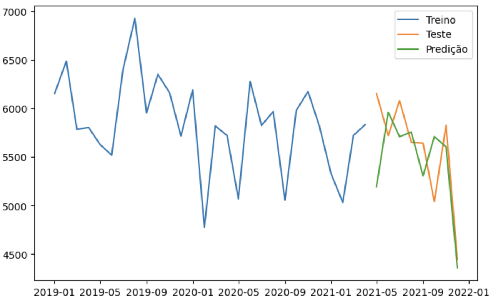
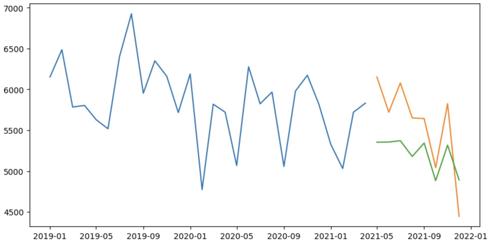
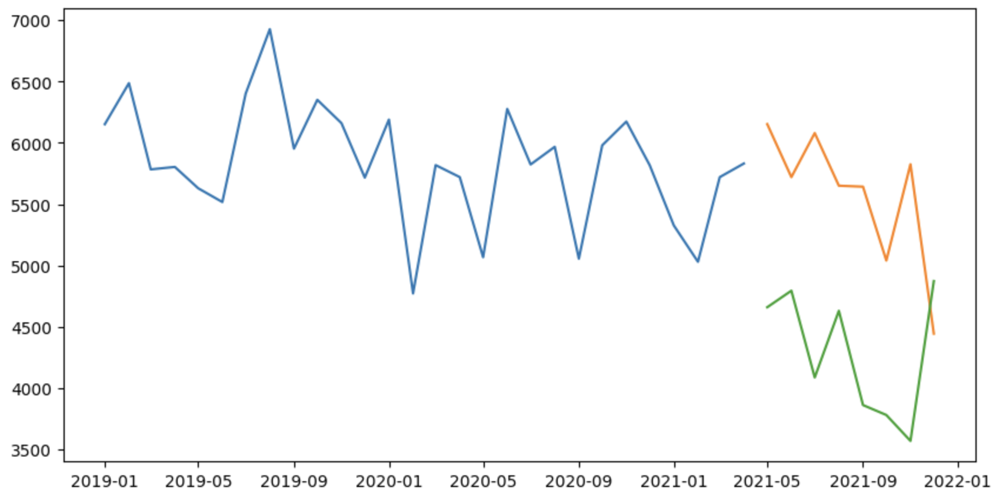

# Previsão consumo medicamento - Redes Neurais Artificiais

# Introdução 
A programação de medicamentos é uma atividade chave no fluxo da Assistência Farmacêutica no Sistema Único de Saúde (SUS), sendo aplicada para estimar as quantidades a serem adquiridas e distribuídas pelos gestores municipais, estaduais e federais. Uma programação inadequada pode refletir no abastecimento, e consequentemente na falta de medicamento nas farmácias do SUS, bem como no desperdício de dinheiro publico quando ocorre uma superestimativa nos quantitativos.
Contudo, estimar o consumo de dezenas de medicamentos no SUS muitas vezes não é uma tarefa fácil e rápida, pois envolve a avaliação de vários critérios. Dessa forma, a aplicação de um modelo de predição para series temporais pode ser útil para aumentar a assertividade das predições, além de reduzir o esforço dos profissionais que atuam na assistência farmacêutica.
Uma serie temporal é uma sequência de observações realizadas em um período. A análise de series temporais permite descrever a dependência dos dados em relação ao tempo e prever valores futuros. Este padrão pode ser do tipo tendencialidade, sazonalidade, ciclicidade ou aleatoriedade.  No caso da Assistência Farmacêutica, é possível utilizar os dados de quantidade dispensada para criar uma serie temporal e ser aplicada em um modelo de programação de medicamentos.

# Objetivo
Criar modelo de predição de séries temporais a partir de redes neurais arificias para os medicamentos filgrastim 300mcg injetável, golimumabe 50mg solução injetável e imiglucerase 400U injetável, pertencentes ao elenco do Componente Especializado da Assistência Farmacêutica (CEAF), a partir dos registros de dispensação do Sistema de Informações Ambulatoriais do SUS (SIA/SUS), e comparação dos resultados com o modelo desenvolvido anteriormente utilizado ARIMA (Autorregressivo Integrado de Médias Móveis).

# Aspectos metodológicos
## Análise comparativa
Para a realização desse estudo foram utilizados os resultados da avaliação previamente elaborada com os mesmos medicamentos, série temporal e período de predição com o modelo ARIMA, disponível em https://github.com/ricardoronsoni/previsao-consumo-medicamento  
Dessa fora, esse estudo limitou-se a testar um modelo de redes neurais artificiais para a previsão de consumo de medicamento.
## Coleta, seleção e preparação dos dados
Os dataframes resultantes do processo de pré-processamento do modelo ARIMA foram utilizados para treinar e testar o novo modelo de redes neurais artificiais, haja vista o objetivo desse estudo é comparar os dois modelos de previsão.  
Assim, não foi necessário realizar a avaliação dos dados (valores nulos, dados incorretos e fora do range de data) pois isso já foi realizado no estudo anterior.  
## Seleção do modelo
Para esse estudo foi selecionado um modelo redes neurais artificiais do tipo recorrente, que ao contrário dos modelos tradicionais possui a capacidade de "lembrar" dos valores em um intervalo de tempo.  
E dentre os modelos recorrentes foi selecionado o modelo de Redes de Memória de Curto Prazo Longo (LSTM), que consistem em um conjunto de células de memória conectadas de forma recorrente e que são capazes de aprender dependência de longo prazo.  
## Calibração do modelo
Para a utilização do LSTM é necessário realizar alguns tratamentos no dataset, e as seguintes etapas foram realizadas.  
### Dimensionalidade
O modelo LSTM presume que dados estão divididos em componentes de entrada (X) e saída (y). Assim, foi adicionada uma nova coluna no dataset relacionando os dados de uma competência com os valores de consumo do mês anterior.
### Diferenciação
Outro requisito é que a série temporal esteja estacionária. Para retirar a tendência foi utilizada a técnica de diferenciação.
### Dimensionamento de escala
Por fim, foi aplicado o operador de normalização Min-Max para dimensionamento dos dados das séries temporais. Dessa forma, os dados foram ajustados para o range de -1 a 1, visando atender a necessidade da função de ativação utilizada.
### Dados de treinamento e teste
Assim como foi selecionado para a predição com o ARIMA, o conjunto de treinamento contou com os 28 primeiros períodos e o de teste com os 8 últimos meses da série temporal.  
Não foi utilizada a técnica Walk Forward para adicionar dados de treinamento a medida que os meses fossem preditos, da mesma que realizado para o Arima.
## LSTM
### Função de ativação
Foi empregada a função de ativação tangente hiperbólica, do tipo sigmoidal, para definir a ativação dos neurônios.
### Retropropagação
O algoritmo de retropropagação fez uso do erro quadrático médio (MSE) para calcular as perdas e promover os ajustes dos pesos de cada neurônio.
### Otimizador
Utilizou-se do algoritmo Adam para realizar as otimizações durante o treinamento da rede neural.
### Parâmetros
O modelo foi treinado contendo uma camada oculta, 1500 épocas, dois neurônios e tamanho do lote de um.
### Repetições
Devido as características estocásticas das redes neurais, repetiu-se o processo de criação e predição dos dados por 30 vezes
## Análise comparativa
Para avaliar o melhor modelo de predição de consumo dos medicamentos foi utilizada a raiz do erro quadrático médio (RMSE). Ela é calculada a partir da raiz quadrática média dos erros entre valores observados (reais) e predições.  
No caso das redes neurais artificiais foi calculada a média do RMSE das 30 iterações.  
O RMSE foi selecionado devido a sua característica de penalizar os erros de maior magnitude, pois os erros são elevados ao quadrado antes de ter a média calculada.  
## Desenvolvimento
Esse estudo foi desenvolvido na linguagem Python 3.10.10 utilizando a interface de implementação para algoritmos de aprendizado de máquina `TensorFlow`, ferramenta esta desenvolvida pela Google. Utilizou-se a Application Programming Interface (API) de Deep Learning `Keras` do `TensorFlow` para criação das redes neurais artificiais.

# Resultados
Segue abaixo o RMSE obtido para cada modelo produzido.  
|                                   | ARIMA (SARIMA) | Redes Neurais Artificiais (LSTM) Média (min, max, std) |
|-----------------------------------|:--------------:|:------------------------------------------------------:|
| Filgrastim 300mcg injetável       |    1489,7211   |           643,5465 (397,6 - 3676.4 - 590,4)            |
| Golimumabe 50mg solução injetável |    1939,0730   |           2069,6140 (1837,4 - 2370,9 - 129,5)          |
| Imiglucerase 400U injetável       |    466,5806    |           736,1034 (508,60 - 1504,6 - 230,4)           |
  
Observa-se as redes neurais artificiais tiveram um desempenho consideravelmente superior ao ARIMA para prever o consumo do medicamento filgrastim 300mcg injetável. Já para o golimumabe 50mg solução injetável os resultados obtidos foram próximos, contudo o ARIMA apresentou a média inferior. Por último, o Imiglucerase 400U injetável apresentou um resultado consideravelmente superior para o ARIMA.  
Como pode ser visto o ARIMA apresentou melhor desempenho para dois medicamentos e as redes neurais artificiais para apenas um. Contudo, é importante observar que modelo criado para o ARIMA passou por processo de tuning com a função `auto_arima`, enquanto que as redes neurais artificias foram modelados apenas com um conjunto de hiper parâmetros. O processo de tuning para o ARIMA representou ganhos que promoveu a mudança dos modelos previamente selecionados de todos os medicamentos para o SARIMA.  
Assim, sugere-se que um próximo estudo seja realizado testando novas configurações de hiper parâmetros para as redes neurais artificiais, como por exemplo a função de ativação, quantidade de camadas ocultas, neurônios, épocas e algoritmo de retropropagação. Adicionalmente, outros modelos para séries temporais podem ser utilizados como o Facebook Prophet, que vem sendo utilizado amplamente, sendo um algoritmo mais recente que oe ARIMA e menos complexo que as redes neurais artificiais.  
Por fim, cabe salientar que a métrica utilizada para verificação do melhor modelo não necessariamente apontará o melhor modelo a ser posto em prática, pois várias variaveis precisam ser avaliadas pelos gestores para apontar o melhor modelo prático.

## Filgrastim 300mcg injetável
### ARIMA (SARIMA)
 
### Redes Neurais Aritificiais (LSTM)
- Menor RMSE:

- Maior RMSE:

## Golimumabe 50mg solução injetável
### ARIMA (SARIMA)

### Redes Neurais Aritificiais (LSTM)
- Menor RMSE:

- Maior RMSE:

## Imiglucerase 400U injetável 
### ARIMA (SARIMA)

### Redes Neurais Aritificiais (LSTM)
- Menor RMSE:

- Maior RMSE:

